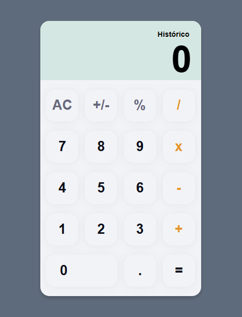

📱 Calculadora em HTML, CSS e JavaScript

Projeto pessoal desenvolvido para praticar HTML, CSS e JavaScript com foco em frontend.
A aplicação é uma calculadora simples que permite realizar operações básicas e mantém um histórico de cálculos diretamente no navegador (sem uso de banco de dados).

🚀 Funcionalidades

Interface responsiva construída com HTML + CSS Grid/Flexbox

Realização das quatro operações matemáticas básicas (+, −, ×, ÷)

Botões numéricos e especiais estilizados com variáveis CSS

Histórico dos últimos cálculos exibido na tela

Persistência do histórico usando LocalStorage

Reset de estilos para consistência entre navegadores

🛠️ Tecnologias Utilizadas

HTML5

CSS3 (variáveis, grid, flexbox, reset básico)

JavaScript Vanilla (ES6)

📂 Estrutura do Projeto
calculadora/
│
├── index.html        # Estrutura principal da calculadora
├── src/
│   ├── css/
│   │   └── style.css # Estilos e variáveis
│   └── js/
│       └── script.js # Lógica da calculadora + histórico
├── assets/           # (opcional) imagens/ícones
└── README.md

🎯 Objetivo do Projeto

Este projeto foi criado para praticar:

Estruturação de layout com HTML semântico

Organização e boas práticas em CSS (variáveis, reset, responsividade)

Manipulação da DOM com JavaScript

Uso do LocalStorage para salvar dados no navegador

Organização de pastas em um projeto frontend

📸 Preview

⚙️ Como Executar

Clone este repositório:

git clone https://github.com/seu-usuario/calculadora.git

Acesse a pasta do projeto:

cd calculadora

Abra o arquivo index.html no navegador.

📌 Próximos Passos (Evolução do Projeto)

 Adicionar animações na interação dos botões

 Implementar modo escuro (dark mode)

 Melhorar responsividade para dispositivos móveis

 Adicionar suporte ao teclado físico

👨‍💻 Autor

Iokim Diego Martins e Silva
Desenvolvedor Full Stack Júnior

🔗 www.iokimdiego.dev.br
